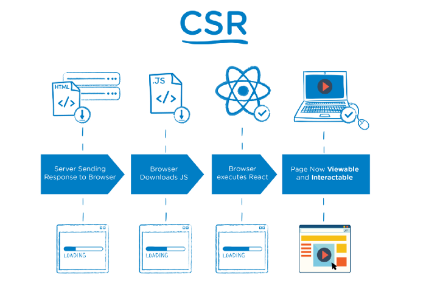
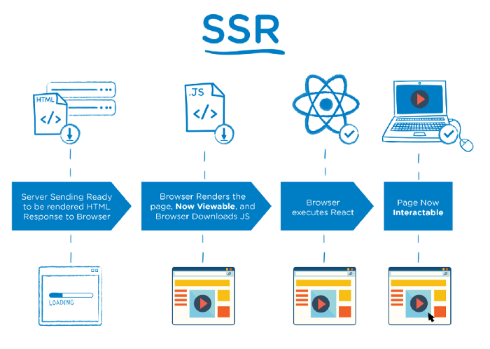
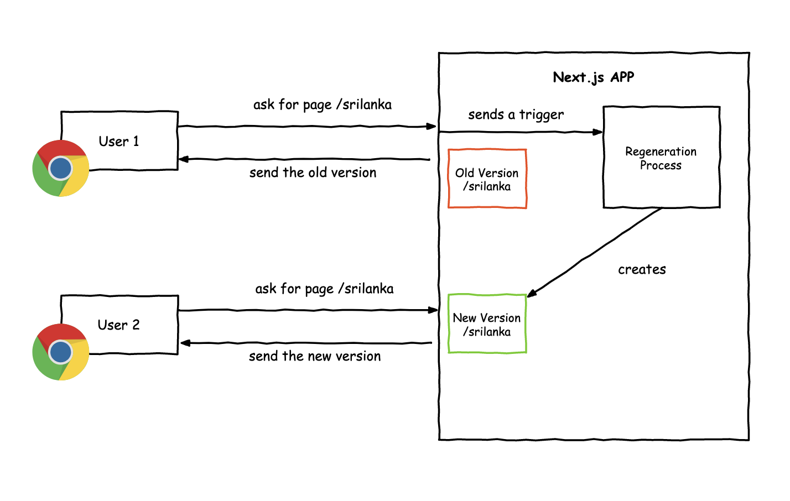

# Devtalks NextJS

NextJS presentation for Devtalks

## Introdução

Next.js é um framework React com foco em produção e eficiência criado e mantido pela equipe da Vercel, o Nextjs busca reunir diversas funcionalidades como renderização hibrida e estática de conteúdo, suporte a TypeScript, pre-fetching, sistema de rotas, pacotes de funcionalidades e diversos plugins e exemplos para acelerar seu desenvolvimento fornecendo uma estrutura completa para você iniciar seu projeto.

## Modelos de Frontend

- Servidores Linux - HTML estático ex: <http://sitedafaculdade.edu/~victor/home.html> **SSR**
- Arquivos binários CGIs (C, C++) - **SSR**
- Python, PHP, Ruby, Perl... - **SSR**
- SproutCore, Ember, Polymer... - **SPA**
- React, Angular, Vue... - **SPA**
- NextJS, Gatsby, NuxtJS... - **SSR**
- ...

## Client Side Rendering

## Server Side Rendering

## Principais Funcionalidades

- Hibrido SSR e SSG
- Hot Code Reloading
- Roteamento Automático
- Code Splitting Automático

## Server Site Generation no NextJS

## Referências

[https://medium.com/swlh/why-nextjs-and-how-to-start-6bf5c28f5a87](https://medium.com/swlh/why-nextjs-and-how-to-start-6bf5c28f5a87)
[https://arunoda.me/blog/what-is-nextjs-issg](https://arunoda.me/blog/what-is-nextjs-issg)

----------
Released in 2021

By [Victor B. Fiamoncini](https://github.com/Victor-Fiamoncini) ☕️
